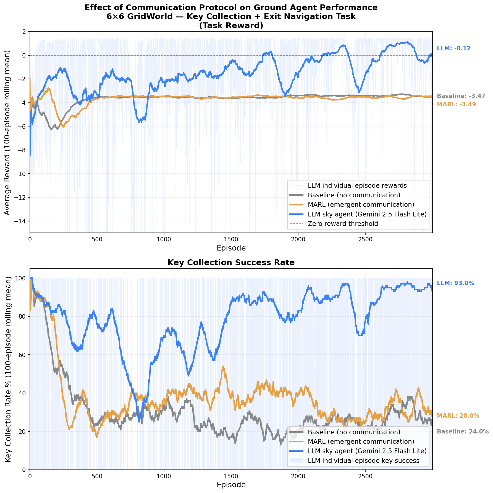

# LLM-Based vs. Emergent Communication in Multi-Agent Reinforcement Learning

This project investigates whether Large Language Models (LLMs) can provide superior, zero-shot guidance in a Multi-Agent Reinforcement Learning (MARL) environment compared to traditional emergent communication channels.

## Project Overview
The environment is a 6x6 GridWorld where a "Ground Agent" must navigate around obstacles to collect a key and then proceed to the exit. However, the ground agent has **partial observability** with it only able to see its current location, location of the goal state, and understanding of walls on the grid if and when it collides with them.

A second "Sky Agent" also has **partial observability** of the grid, with it able to see the Ground Agent's location, they Key's location, and nothing else. It also cannot move and its sole purpose is to communicate to the Ground Agent to help it find the key which it cannot see. 

We compare three paradigms for how the Sky Agent assists the Ground Agent:
1. **Baseline**: No communication whatsoever.
2. **Emergent MARL**: The Sky Agent is a Deep Q-Network that passes continuous vector messages to the ground agent, trained jointly via backpropagation.
3. **LLM Communication**: The Sky Agent is replaced by Gemini 2.5 Flash Lite, which parses the grid state and zero-shot generates directional Q-value priors for the ground agent.

_Note: All neural networks and deep Q-learning logic (experience replay, target networks, bellman equations) are implemented entirely from scratch in pure NumPy (**no ML libraries at all**)._

## Results
The LLM communication protocol dramatically outperforms the emergent MARL baseline, achieving up to 90%+ task completion rates compared to the emergent network's peak of ~40%. Most notably, the zero-shot nature of the LLM provides high-quality guidance from the very first episode.



## Installation & Setup
This project requires no deep learning frameworks — just standard Python libraries.

```bash
# 1. Clone the repository
git clone <your-repo-link>
cd <repo-name>

# 2. Install requirements
python3 -m pip install numpy python-dotenv google-genai matplotlib
```

### API Key & Caching Strategy
To ensure the LLM experiments are easily reproducible without requiring graders or reviewers to supply their own API keys, **I have committed `llm_cache.json` to this repository.**

This cache stores the LLM's pre-computed responses to every possible spatial configuration in our GridWorld. When you run the LLM script, it will fetch responses from this local cache (taking microseconds) rather than making live API calls. 

*(If you wish to make live API calls or modify the prompt, copy `.env.example` to `.env` and add your own Gemini API key).*

## Running the Experiments

You can train the agents in all three paradigms using the provided scripts. Each script trains for 3,000 episodes and will save its results as `.npy` files.

```bash
# 1. Run Baseline (No Comm)
python3 train_baseline.py

# 2. Run Emergent MARL Protocol
python3 train_marl.py

# 3. Run LLM Protocol (Uses local cache by default)
python3 train_llm.py

# 4. Generate the comparative graph
python3 plot_results.py
```

## Architecture Details
* **Experience Replay**: Implemented using a rolling `deque` taking random mini-batches of size 32.
* **Target Networks**: Uses a frozen target network updated every 100 steps to stabilize Bellman targets and prevent the "moving target" problem.
* **Epsilon Greedy**: Epsilon decays by a factor of `0.995` maxing out at `0.1` minimum exploration.
